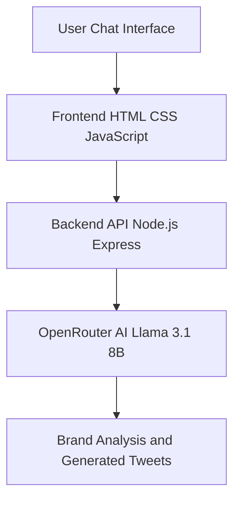
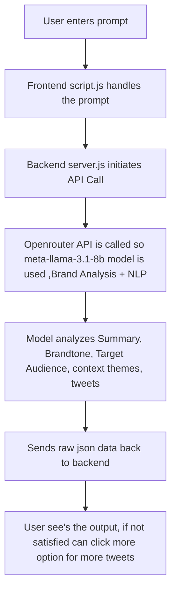

**AI  Tweet Generator**
* An AI-powered tweet generation tool that helps marketers and creators generate brand-aligned tweets based on campaign inputs like brand name, product, industry, and campaign objective.
* An AI-powered tweet generation tool that helps marketers and creators generate brand-aligned tweets based on campaign inputs like brand name, product, industry, and campaign objective.
  
**Features**
* AI-powered tweet generation.
• Chat-based interactive interface.
• Automatic extraction of campaign details.
• Brand tone and audience analysis.
• Content theme identification.
• Generates 10 tweets per request.
• Viral score estimation for tweets.
• Edit previous prompts easily.
• Generate more tweets on demand.
• Clean structured output format.

**System Architecture**

**Wrokflow**

    
 
