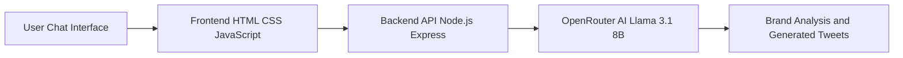

**AI  Tweet Generator**
* An AI-powered tweet generation tool that helps marketers and creators generate brand-aligned tweets based on campaign inputs like brand name, product, industry, and campaign objective.
* An AI-powered tweet generation tool that helps marketers and creators generate brand-aligned tweets based on campaign inputs like brand name, product, industry, and campaign objective.
  
**Features**
* AI-powered tweet generation.
• Chat-based interactive interface.
• Automatic extraction of campaign details.
• Brand tone and audience analysis.
• Content theme identification.
• Generates 10 tweets per request.
• Viral score estimation for tweets.
• Edit previous prompts easily.
• Generate more tweets on demand.
• Clean structured output format.

**System Architecture**

**Wrokflow**
           ┌────────────────────┐
           │        User        │
           │  (Chat Interface)  │
           └─────────┬──────────┘
                     │
                     ▼
        ┌─────────────────────────┐
        │        Frontend         │
        │  HTML + CSS + JS (UI)   │
        │ Handles Chat Messages   │
        └─────────┬───────────────┘
                  │ API Request
                  ▼
        ┌─────────────────────────┐
        │        Backend API      │
        │     Node.js + Express   │
        │  Routes: /extract       │
        │          /generate      │
        └─────────┬───────────────┘
                  │
                  ▼
        ┌─────────────────────────┐
        │       OpenRouter AI     │
        │  meta-llama-3.1-8b      │
        │   Brand Analysis + NLP  │
        └─────────┬───────────────┘
                  │
                  ▼
        ┌─────────────────────────┐
        │     AI Response JSON    │
        │  Summary                │
        │  Brand Tone             │
        │  Target Audience        │
        │  Content Themes         │
        │  10 Generated Tweets    │
        └─────────┬───────────────┘
                  │
                  ▼
        ┌─────────────────────────┐
        │        Frontend UI      │
        │  Structured Tweet Cards │
        │  Copy / Edit / More     │
        └─────────┬───────────────┘
                  │
                  ▼
           ┌────────────────────┐
           │      User View     │
           │ Generated Tweets   │
           └────────────────────┘

