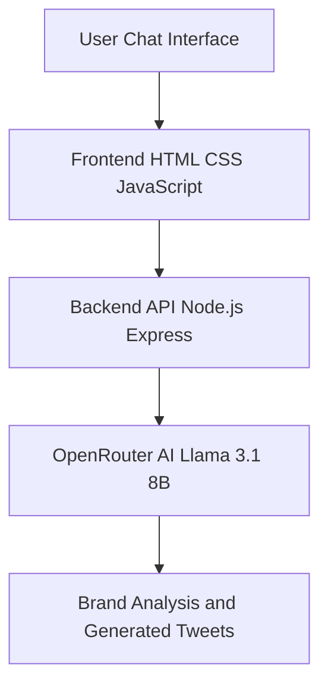
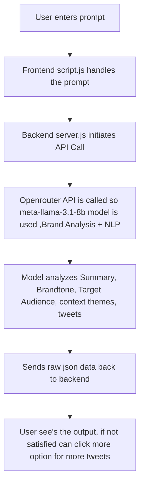

**AI  Tweet Generator**
* An AI-powered tweet generation tool that helps marketers and creators generate brand-aligned tweets based on campaign inputs like brand name, product, industry, and campaign objective.
* An AI-powered tweet generation tool that helps marketers and creators generate brand-aligned tweets based on campaign inputs like brand name, product, industry, and campaign objective.
  
**Features**
* AI-powered tweet generation.
• Chat-based interactive interface.
• Automatic extraction of campaign details.
• Brand tone and audience analysis.
• Content theme identification.
• Generates 10 tweets per request.
• Viral score estimation for tweets.
• Edit previous prompts easily.
• Generate more tweets on demand.
• Clean structured output format.

**System Architecture**

**Wrokflow**

**Used render for safe API Deployment**

**Live webpage** : https://mahesh20l.github.io/ai-tweets-backend/ 

**Conclusion** : 
The AI Tweet Generator Tool demonstrates how modern AI models can be 
integrated into a full-stack web application to automate social media content 
creation. By combining a chat-based user interface, a Node.js backend API, and 
the meta-llama/llama-3.1-8b-instruct model via OpenRouter, the system is able 
to understand user input, extract relevant marketing information, analyses brand 
characteristics, and generate creative tweet suggestions.
 
